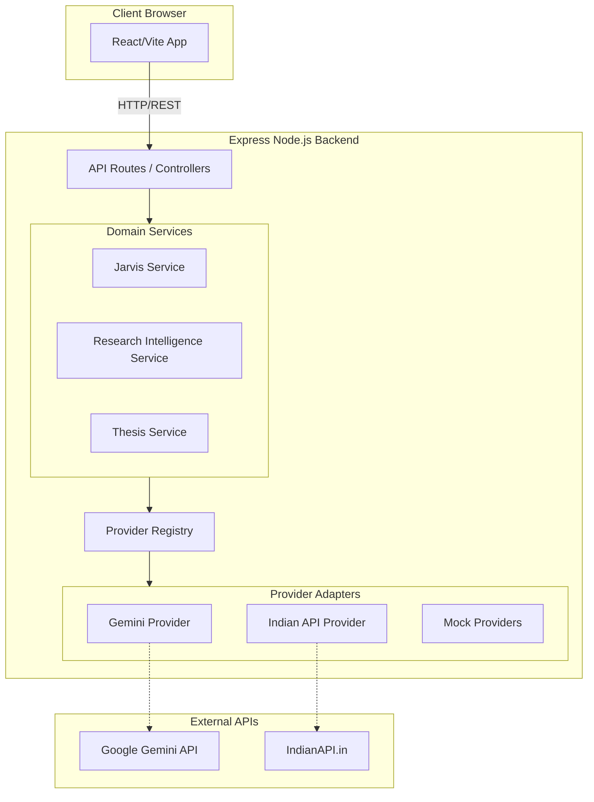

# Nexora Architecture

This document outlines the high-level architecture of the Nexora Investment Intelligence OS. It reflects the stable foundation established as of Sprint 6.6.

## Overview

Nexora is built as a **Modular Monolith**. It consists of a React frontend and an Express Node.js backend. The backend acts as the orchestration layer, connecting external data providers (Market Data, News, LLMs) to our internal domain logic.

## Core Principles

1. **Facts First, AI Second**: The system must ground all AI reasoning in verifiable, source-attributed data. The LLM is an evaluation engine, not a search engine.
2. **Provider Agnostic**: The application's core domain logic (e.g., `JarvisService`, `ResearchIntelligenceService`) never imports specific SDKs or API clients directly. It communicates exclusively through our own provider interfaces (`LLMProvider`, `MarketDataProvider`).
3. **Structured Contracts**: The boundary between the Backend and Frontend, as well as between the Backend and External Providers, is protected by strict TypeScript interfaces and Zod schemas.

## Component Breakdown

### 1. Frontend (React + Vite)
- **Role**: Presentation and local state management.
- **Key Technologies**: React, TypeScript, Tailwind CSS, Framer Motion, React Router.
- **Responsibility**: Rendering the `Research Workspace`, `Thesis Builder`, and `Jarvis Review` UIs. It communicates with the backend via REST endpoints and gracefully falls back to mock data if the backend is unreachable during development.

### 2. Backend (Node.js + Express)
- **Role**: Orchestration, data fetching, and AI prompt engineering.
- **Key Technologies**: Express, TypeScript, Zod.
- **Responsibility**: Providing secure API endpoints, validating incoming requests, and constructing prompt contexts for the LLM.

### 3. Provider Registry (`config/providers.ts`)
- **Role**: Dependency Injection.
- **Responsibility**: Detecting available environment variables (e.g., `GEMINI_API_KEY`, `INDIAN_API_KEY`) and instantiating the correct provider implementations. If keys are missing, it silently falls back to Mock providers, allowing local development without requiring paid API access.

### 4. Domain Services
- **`JarvisService`**: Responsible for taking an `InvestmentThesis`, fetching current `ResearchIntelligence`, building a strictly-formatted Markdown context, calling the `LLMProvider`, and validating the resulting JSON against a Zod schema.
- **`ResearchIntelligenceService`**: Responsible for aggregating market data and news from multiple external providers into a unified, canonical intelligence object.

## Security & Data Flow

- **API Keys**: Stored exclusively on the backend (`.env`). The frontend never possesses or requests LLM or Data Provider API keys.
- **Error Handling**: Raw provider errors (e.g., Gemini timeouts, IndianAPI 500s) are caught by the backend and sanitized into user-friendly `503 Service Unavailable` responses before reaching the frontend.
- **Zod Validation**: All data crossing the boundary from an external provider into Nexora is parsed via a Zod schema (e.g., `jarvisOutputSchema`). If an LLM hallucinates an invalid JSON structure, the transaction fails server-side rather than crashing the client UI.

## Future Evolution (Phase 3+)
The current architecture is stateless. In upcoming phases, a PostgreSQL database (via Prisma or Drizzle ORM) will be injected between the API Routes and Domain Services to provide persistent storage for Companies, Theses, and User accounts.
